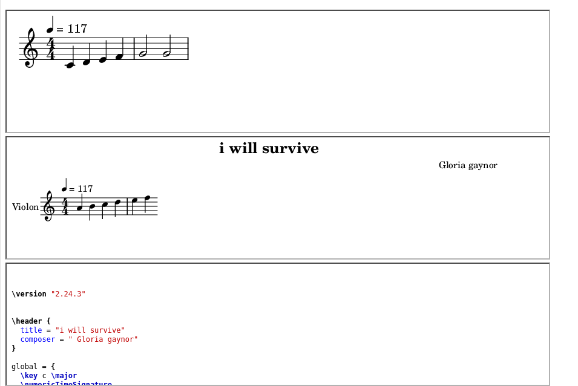
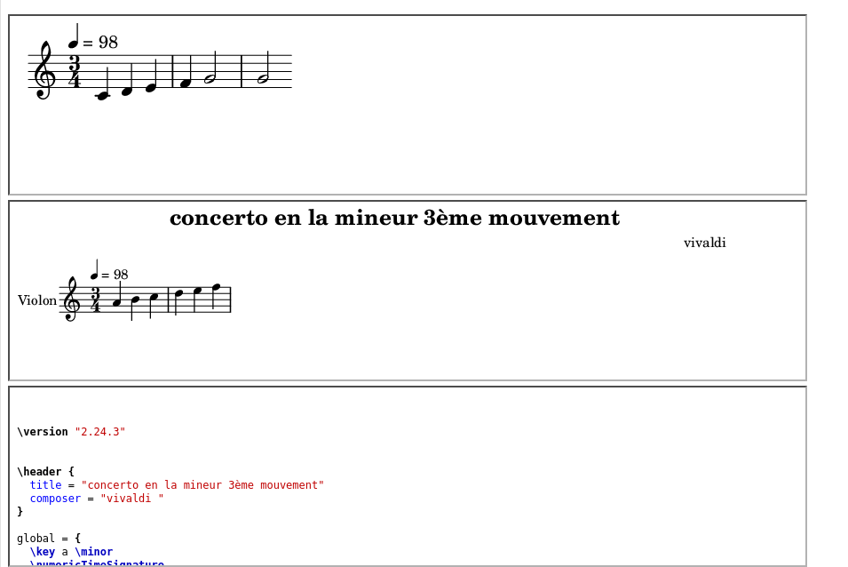

# README violonrama / violin maker :violin:

# violonrama
- violonrama est juste si tu peux jouer une piece d'un morceau artiste ou un compositeur en entier/et /ou un fragment
- violin maker (en mode connexion) est si tu es arrivée dans une ville / et avec quel instrument / quel violin maker/marque
- fais de la musique et sauvegarde /collectionne tes fragments de musique favoris ou partition que tu aimes jouer
- pendant l'inscription, rentre le modele , annee de fabrication de ton instrument de musique, numero de serie, fabricant ou marque, et le modele, et la ville ou tu es et ton arrivvee dans la ville. Eventuellemment ton pays et ton numero de telephone, nom , et email.
